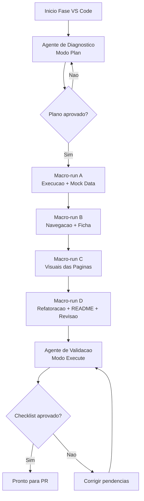

# Prompts para Codex no VS Code (Versão Otimizada por Agentes)

Use este guia depois que o Codex Web gerar a primeira estrutura.

Objetivo desta fase:

- estabilizar execução local;
- consolidar contrato de dados mockados;
- corrigir navegação entre páginas e ficha;
- melhorar visual e legibilidade sem expandir escopo;
- preparar revisão final para apresentação.

## Configuração recomendada de agentes

### Agente de Diagnóstico

- Modo: Plan
- Uso: mapear erros, inconsistências e riscos antes de editar arquivos.
- Saída esperada: lista priorizada de problemas + plano curto de execução.

### Agente de Implementação

- Modo: Execute
- Uso: aplicar mudanças por lotes coesos (dados, navegação, UI, componentes).
- Saída esperada: alterações concluídas + validação local básica.

### Agente de Validação

- Modo: Execute
- Uso: smoke test final de páginas, fluxo de paciente e consistência de dados.
- Saída esperada: checklist final com evidências de funcionamento.

## Arquitetura dos agentes (Mermaid)



## Bloco padrão para anexar em todos os prompts

```text
Restrições obrigatórias:
- Não alterar o escopo funcional definido para esta rodada.
- Não implementar parser real, Supabase, login, deploy ou integrações externas.
- Preservar nomes de campos e contrato de dados de src/mock_data.py.
- Antes de editar, listar rapidamente os arquivos que serão alterados.
- Após editar, validar execução local e reportar erros remanescentes.
- Entregar resumo final com: arquivos alterados, impacto e riscos.
```

## Ordem de execução otimizada (macro-runs)

### Macro-run A — Base técnica

Use primeiro o Agente de Diagnóstico em modo Plan, depois Agente de Implementação em modo Execute.

#### A1. Corrigir execução local

```text
Rode uma revisão do projeto e corrija qualquer erro que impeça streamlit run app.py de funcionar. Não altere o escopo do projeto. Corrija imports, nomes de módulos, dependências e chamadas quebradas.
```

#### A2. Consolidar mock_data

```text
Revise src/mock_data.py e garanta que a função load_mock_data() retorne todos estes DataFrames: patients, treatment_plans, treatment_plan_items, execution_summary, appointments, appointment_items, patient_goals, weight_entries, satisfaction_entries, alerts e data_quality_issues. Garanta consistência de IDs entre tabelas.
```

### Macro-run B — Fluxo de navegação

#### B1. Corrigir navegação por paciente

```text
Implemente ou corrija a navegação com st.session_state para que selecionar um paciente nas telas Pacientes, Visão Geral, Mapa de Decisão ou Alertas abra a página Ficha do Paciente com o paciente correto.
```

#### B2. Melhorar Ficha do Paciente

```text
Melhore a página Ficha do Paciente mantendo o schema atual. Ela deve mostrar cabeçalho, KPIs do paciente, gráfico de peso esperado vs realizado, tabela de execução do plano, últimos agendamentos e alertas do paciente.
```

### Macro-run C — Qualidade visual e legibilidade

#### C1. Melhorar Visão Geral

```text
Melhore a tela Visão Geral usando st.columns, st.metric, st.container e Plotly. A tela deve ficar clara para apresentação ao cliente, com dados fictícios e aviso discreto de que é uma casca navegável.
```

#### C2. Melhorar Mapa de Decisão

```text
Melhore o Mapa de Decisão para exibir uma matriz 2x2 com os quatro quadrantes: Engajado + Satisfeito, Engajado + Não satisfeito, Não engajado + Satisfeito, Não engajado + Não satisfeito. Mostre chips/iniciais dos pacientes e permita abrir a ficha do paciente.
```

#### C3. Melhorar Alertas

```text
Revise a tela Alertas para permitir filtro por categoria: Todos, Enfermagem, Médica, Comercial e Nutrição. Mostre prioridade, status, paciente, descrição e data. Permita abrir ficha do paciente.
```

#### C4. Melhorar Qualidade dos Dados

```text
Melhore a tela Qualidade dos Dados para exibir score geral, barras de completude/consistência/validade/atualidade e uma tabela de lacunas. Inclua lacunas de peso, satisfação, objetivo e renovação.
```

### Macro-run D — Fechamento

#### D1. Refatorar componentes

```text
Refatore componentes repetidos para src/components, especialmente cards de KPI, badges de status, tabela de alertas e cabeçalho de paciente. Não mude o comportamento visual sem necessidade.
```

#### D2. Preparar README

```text
Atualize o README com: objetivo do projeto, como instalar, como rodar, estrutura de pastas, escopo da casca navegável, o que ainda não está implementado e próximos passos para integração com dados reais.
```

#### D3. Revisão final antes de apresentar

```text
Faça uma revisão final da casca navegável. Garanta que todas as páginas abram, que a navegação funcione, que os dados mockados sejam coerentes e que não existam erros visíveis. Não implemente funcionalidades fora do escopo.
```

## Critério de passagem entre macro-runs

- Não avançar de macro-run se houver erro que quebre streamlit run app.py.
- Sempre validar navegação para Ficha do Paciente após mudanças em estado.
- Sempre registrar pendências explícitas quando algo ficar para a próxima etapa.

## Agentes customizados no projeto

Este repositório possui agentes prontos em .github/agents:

- map-diagnostico.agent.md
- map-implementacao.agent.md
- map-validacao.agent.md

E prompts prontos em .github/prompts:

- macro-run-a.prompt.md
- macro-run-b.prompt.md
- macro-run-c.prompt.md
- macro-run-d.prompt.md
- validacao-final.prompt.md

Fluxo operacional recomendado:

1. Selecionar agente map-diagnostico para planejamento da rodada.
2. Executar macro-run-a, macro-run-b, macro-run-c e macro-run-d com map-implementacao.
3. Encerrar com validacao-final usando map-validacao.

## Versão copiar e colar por macro-run

Use os prompts abaixo diretamente no Codex VS Code.

### Prompt único — Macro-run A (Base técnica)

```text
Você está na Macro-run A (Base técnica) deste projeto Streamlit.

Objetivo:
1) Corrigir qualquer erro que impeça streamlit run app.py.
2) Consolidar src/mock_data.py garantindo que load_mock_data() retorne os DataFrames:
patients, treatment_plans, treatment_plan_items, execution_summary, appointments,
appointment_items, patient_goals, weight_entries, satisfaction_entries, alerts,
data_quality_issues.
3) Garantir consistência de IDs entre tabelas.

Restrições obrigatórias:
- Não alterar o escopo funcional definido para esta rodada.
- Não implementar parser real, Supabase, login, deploy ou integrações externas.
- Preservar nomes de campos e contrato de dados de src/mock_data.py.
- Antes de editar, listar rapidamente os arquivos que serão alterados.
- Após editar, validar execução local e reportar erros remanescentes.
- Entregar resumo final com: arquivos alterados, impacto e riscos.
```

### Prompt único — Macro-run B (Navegação + ficha)

```text
Você está na Macro-run B (Fluxo de navegação) deste projeto Streamlit.

Objetivo:
1) Implementar/corrigir navegação com st.session_state para que selecionar paciente em
Pacientes, Visão Geral, Mapa de Decisão e Alertas abra a Ficha do Paciente correta.
2) Melhorar a página Ficha do Paciente mantendo o schema atual, incluindo:
cabeçalho, KPIs, gráfico de peso esperado vs realizado, tabela de execução,
últimos agendamentos e alertas do paciente.

Restrições obrigatórias:
- Não alterar o escopo funcional definido para esta rodada.
- Não implementar parser real, Supabase, login, deploy ou integrações externas.
- Preservar nomes de campos e contrato de dados de src/mock_data.py.
- Antes de editar, listar rapidamente os arquivos que serão alterados.
- Após editar, validar execução local e reportar erros remanescentes.
- Entregar resumo final com: arquivos alterados, impacto e riscos.
```

### Prompt único — Macro-run C (Melhorias visuais)

```text
Você está na Macro-run C (Qualidade visual e legibilidade) deste projeto Streamlit.

Objetivo:
1) Melhorar Visão Geral com st.columns, st.metric, st.container e Plotly,
mantendo clareza para apresentação ao cliente.
2) Melhorar Mapa de Decisão em matriz 2x2 com quadrantes:
Engajado + Satisfeito, Engajado + Não satisfeito,
Não engajado + Satisfeito, Não engajado + Não satisfeito,
com chips/iniciais e abertura da ficha.
3) Melhorar Alertas com filtro por categoria (Todos, Enfermagem, Médica,
Comercial, Nutrição), exibindo prioridade, status, paciente, descrição e data,
com ação para abrir ficha.
4) Melhorar Qualidade dos Dados com score geral, barras de
completude/consistência/validade/atualidade e tabela de lacunas incluindo
peso, satisfação, objetivo e renovação.

Restrições obrigatórias:
- Não alterar o escopo funcional definido para esta rodada.
- Não implementar parser real, Supabase, login, deploy ou integrações externas.
- Preservar nomes de campos e contrato de dados de src/mock_data.py.
- Antes de editar, listar rapidamente os arquivos que serão alterados.
- Após editar, validar execução local e reportar erros remanescentes.
- Entregar resumo final com: arquivos alterados, impacto e riscos.
```

### Prompt único — Macro-run D (Fechamento)

```text
Você está na Macro-run D (Fechamento) deste projeto Streamlit.

Objetivo:
1) Refatorar componentes repetidos para src/components
(cards de KPI, badges de status, tabela de alertas, cabeçalho de paciente),
sem mudar comportamento visual sem necessidade.
2) Atualizar README com: objetivo, instalação, execução, estrutura de pastas,
escopo da casca navegável, o que ainda não está implementado e próximos passos.
3) Fazer revisão final: todas as páginas abrem, navegação funciona,
dados mockados coerentes e sem erros visíveis.

Restrições obrigatórias:
- Não alterar o escopo funcional definido para esta rodada.
- Não implementar parser real, Supabase, login, deploy ou integrações externas.
- Preservar nomes de campos e contrato de dados de src/mock_data.py.
- Antes de editar, listar rapidamente os arquivos que serão alterados.
- Após editar, validar execução local e reportar erros remanescentes.
- Entregar resumo final com: arquivos alterados, impacto e riscos.
```
